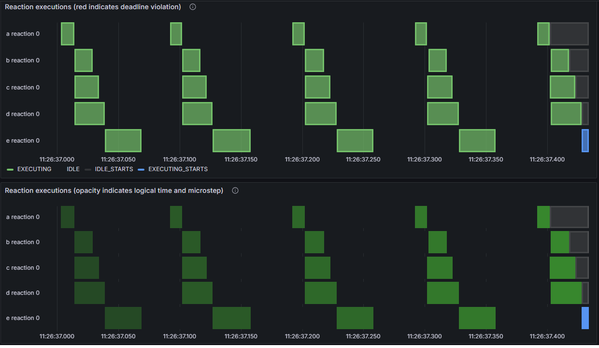
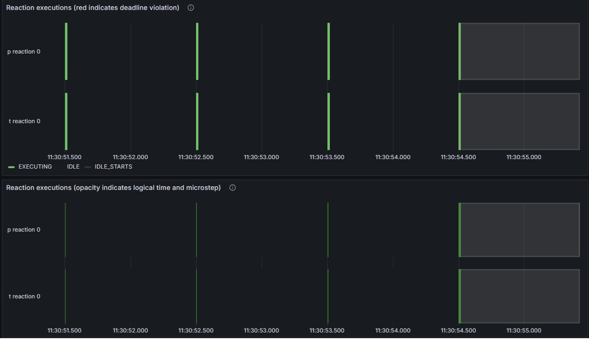

## Xronos Dashboard Test
Use some simple Lingua Franca programs to test whether the dashboard can visualize the expected software behavior

Checkpoint
- Reactor Run Order
- Reactor execution timing (e.g periodically) and jitter
- Reaction execution time

## Test Program

<table>
<tr>
<td> <b>LF Test code</b> </td>
<td> <b>Description</b> </td>
<td> <b>Diagram</b> </td>
</tr>
<tr>
<td> <a href="src/Single_Thread.lf">Single_Thread.lf</a>
<td> Test Single Thread LF program </td>
<td> 
</tr>
<tr>
<td> <a href="src/Multi_Thread.lf">Multi_Thread.lf</a>
<td> Test Multi Thread LF program </td>
<td> 
</tr>
<tr>
<td> <a href="src/Timer.lf">Timer.lf</a>
<td> A simple test program that runs the sensor reactor periodically and displays the sensor output in the print reactor.  </td>
<td> 
</tr>
</table>

## Test Instruction

Run Xronos-Dashboard
- See: [Xronos-Dashboard](https://github.com/xronos-inc/xronos-dashboard/tree/main)

Compile LF file
```sh
lfc src/Single_Thread.lf
```

Docker Run 
```sh
docker run --network xronos-dashboard --rm -it single_thread-main
```
Grafana
- host: `http://localhost:3000`
- username: `admin`
- password: `linguafranca`

## Test Result

Single Thread


Multi Thread


Timer

